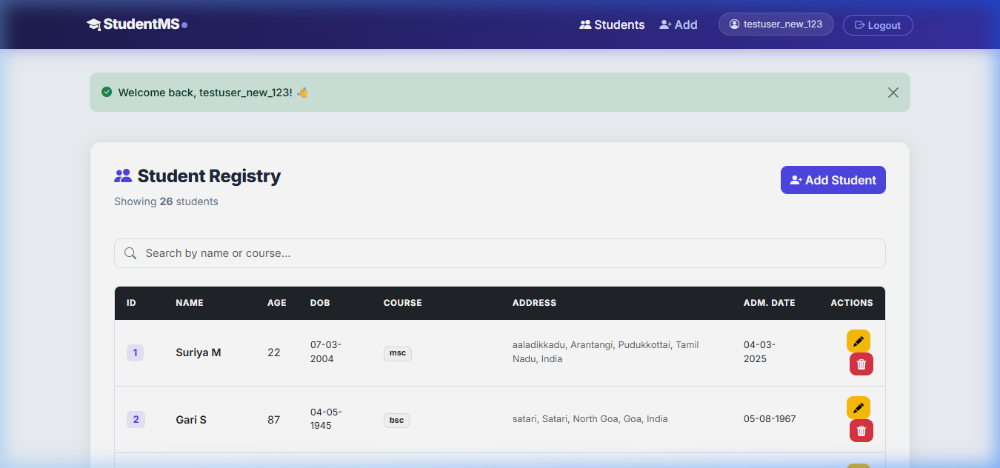
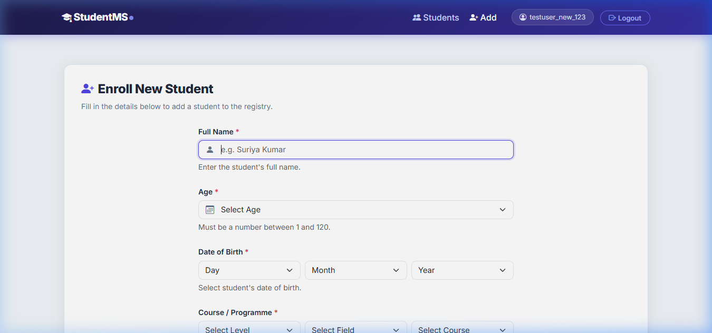
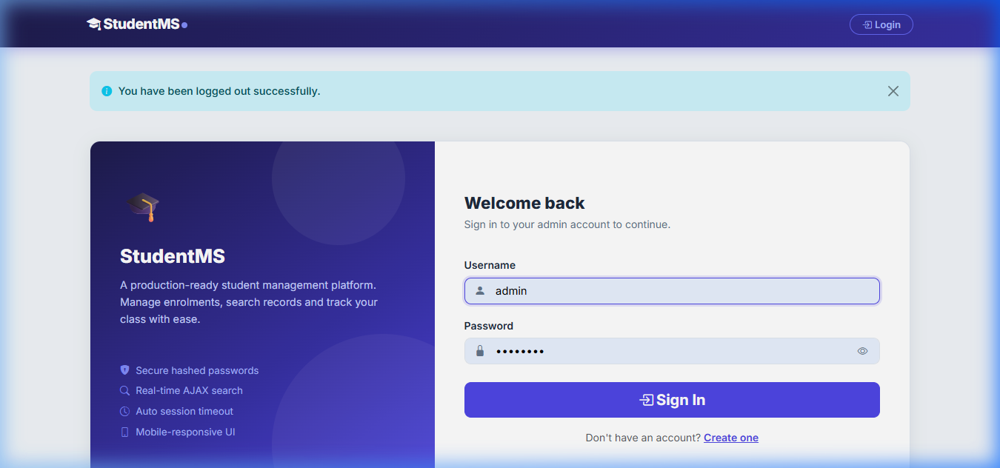

#  StudentMS — Intelligent Academic Registry

A premium, production-ready Full Stack Student Management System. Built with a focus on **Intelligent Address Automation**, **Real-Time Search**, and a **Sophisticated Course Selection Engine**. 

Designed for scalability and administrative excellence using **Flask**, **MySQL**, and **Bootstrap 5**.

---

##  Application Showcase

<p align="center">
  
  <br>
  <i><b>Figure 1:</b> The interactive Student Registry Dashboard with AJAX Live-Search and dynamic record management.</i>
</p>

<table align="center" width="100%">
  <tr>
    <td width="50%"></td>
    <td width="50%"></td>
  </tr>
  <tr>
    <td align="center"><b>New Student Enrollment</b> (Cascading Indian Address & Course selection)</td>
    <td align="center"><b>Secure Portal Access</b> (Session-based Authentication)</td>
  </tr>
</table>

---

## Key Features

###  Intelligent Geography & Address System
- **All-India Geodata Integration**: A comprehensive cascading selector system for **State → District → Taluka → Village**.
- **PINCODE Power-Fetch**: Enter a 6-digit PIN and click "Fetch" to auto-populate the administrative hierarchy using the **Nationwide Postal API**.
- **Real-Time Village Suggestions**: Autocomplete search for Village and Post-Office names instantly.

###  Advanced Course Selection Engine
- **3-Tier Hierarchy**: Smart selection for **Level → Field → Course Name** (e.g., *Undergraduate → Engineering → B.Tech CSE*).
- **Comprehensive Database**: Pre-loaded with hundreds of Indian academic degrees from Medical and Engineering to Arts and Vocational fields.
- **Auto-Parsing Logic**: Intelligent enough to parse existing student courses and auto-select the hierarchy during record updates.

###  Search & UI Excellence
- **AJAX Live Filter**: Search through thousands of records instantly by Name, Course, or ID without a page refresh.
- **Automated Age Calculation**: Age is instantly calculated from the **Date of Birth** calendar selection, ensuring data accuracy.
- **Calendar-Based Input**: Modern, native calendar pickers for **Date of Birth** and **Admission Date** (System Auto-set).
- **Live Camera Capture**: Take student photos directly from the web browser's webcam.
- **Premium UX Design**: Fluid transitions, hover effects, and a mobile-first responsive layout powered by **Bootstrap 5**.

###  Security & Architecture
- **Auth Guard**: Password hashing with **PBKDF2** and secure session handling.
- **Session Timeout Protection**: 30-minute inactivity window with a live **Countdown Modal Alert** and auto-logout.
- **ID Integrity**: Automated sequential ID rebalancing to maintain a gap-free and professional registry.

---

##  Technology Stack

| Layer | Technology | Purpose |
| :--- | :--- | :--- |
| **Logic** | Python 3, Flask | Backend Server & API Routing |
| **Storage** | MySQL (MariaDB) | Student & User Data Integrity |
| **UI/UX** | HTML5, CSS3, ES6+ | Modern Frontend Interactivity |
| **Styling** | Bootstrap 5, Icons | Grid System & Aesthetic Components |
| **Data** | Geodata (JSON), PostOffice API | Indian Geography Intelligence |

---

##  Installation & Local Setup

### 1. Database Configuration
1. Install **MySQL Server** and create a database named `student_db`.
2. Execute the following SQL to initialize the registry:

```sql
CREATE DATABASE student_db;
USE student_db;

-- User Authentication Table
CREATE TABLE users (
    id INT AUTO_INCREMENT PRIMARY KEY,
    username VARCHAR(50) UNIQUE NOT NULL,
    password VARCHAR(255) NOT NULL
);

-- Student Information Table
CREATE TABLE students (
    id INT PRIMARY KEY,
    name VARCHAR(100) NOT NULL,
    age INT NOT NULL,
    dob DATE NOT NULL,
    course VARCHAR(100) NOT NULL,
    address TEXT NOT NULL,
    admission_date DATE NOT NULL
);
```

### 2. Update Credentials
In `main.py`, update your MySQL connection details:
```python
def get_db_connection():
    return mysql.connector.connect(
        host="localhost",
        user="root",
        password="YOUR_MYSQL_PASSWORD",
        database="student_db"
    )
```

### 3. Launch the Application
```bash
# Install dependencies
pip install flask mysql-connector-python werkzeug

# Run the server
python main.py
```
> Explore the registry at **http://127.0.0.1:5000**

---

##  Project Navigation
```text
├── main.py                # Server-side Logic & DB Controllers
├── docs/                  # Project Documentation
│   └── screenshots/       # UI Showcase Assets
├── static/                # CSS, JS, and Local Data (Geodata/Courses)
├── templates/             # Jinja2 Layouts (Modern UI Components)
└── README.md              # Project Masterpiece
```

---

##  License & Attribution
Designed and Developed with  by **[Suriyaprakash S](https://github.com/suriyaprakash460)**  
*Built for educational and administrative excellence.*  
&copy; 2024 **StudentMS** — A Suriyaprakash Venture
